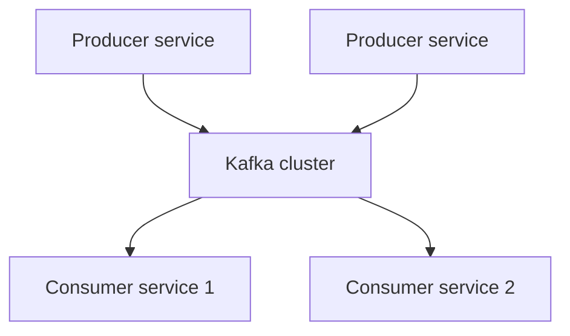

### Introduction to Kafka

Kafka is leading the way to move from ETL - extract, transform and load and batch workflows to near-real-time data feeds.

##### What is Kafka
as a distributed streaming platform. It has three main capabilities:
- Reading and writing records like a message queue
- Storing records with fault-tolerant
- Processing streams as they occur

Data doesn't have to be limited to only a single destination. The producers and consumers are completely decoupled, allow each client to work independently.

Delivery methods:
- _At least-once semantics_ - A message is sent  as needed until it is acknowledged.
- _At most-once semantics_ - A message is only sent once and not resent on failure
- _Exactly-once semantics_ - A message is only seen once by the consumer of the message.

##### At least once semantics
![[notes/images/kafka-at-least-once.png]]

##### At most once sematics

![[notes/images/kafka-at-most-once.png]]

##### Exactly once semantics

![[notes/images/kafka-exactly-once.png]]

- "Dogfoods" itself
For example, Kafka uses topics internally to manage consumer's offsets.

##### Kafka is not the same as other message broker
- The ability to replay messages by default
- parallel processing of data
- Kafka was designed to have multiple consumers.

##### Kafka in real-world
- XMPP (Extensible Messaging and Presence Protocol)
- JMS - Java Message Service (Jakarta EE)
- OASIS Advanced Message Queuing Protocol (AMQP)

Features:
- HA
Apache Flume - data replication
- Log aggregation - the log files are sent as messages into Kafka, and then different applications have a single logical topic to consume that information.

##### When Kafka might not be the right fit
- You only need a once-monthly or even once-yearly summary of aggregate data.
- Random lookup of data
- exact ordering of messages 
- larger than 1MB message size

### Getting to know Kafka

Kafka is a distributed system at heart, but it also possible to install and run it on a single host.

##### Producing and consuming a message
![[notes/images/kafka-message-structure.png]]

##### What are brokers?
Brokers can be thought of as the server side of Kafka.

[[Kafka CLI]]